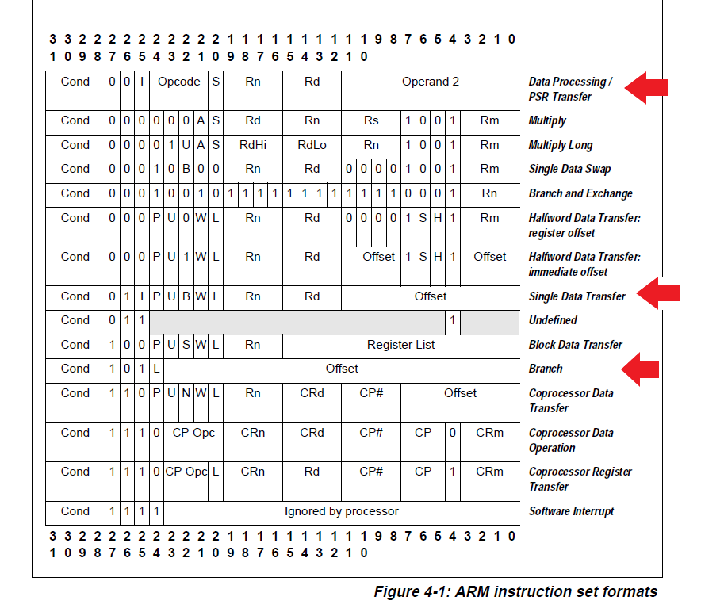
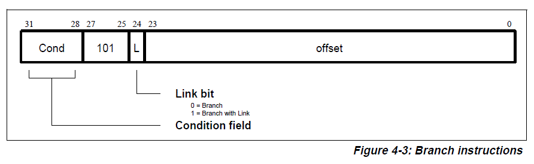
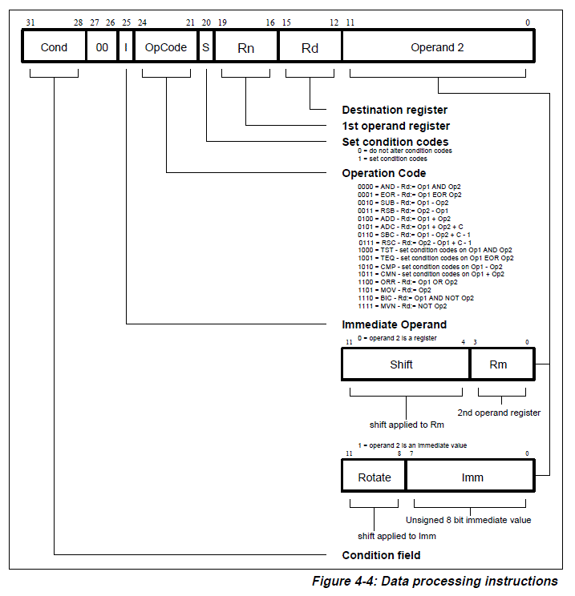
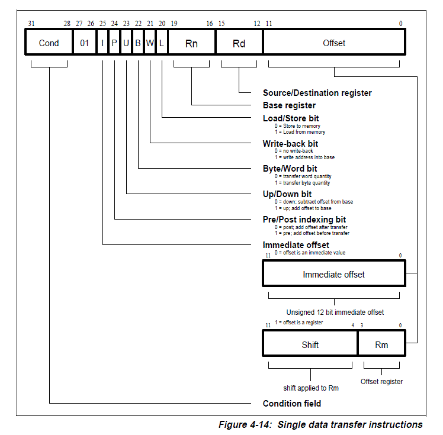

# The ARM ISA
Note that this document is intended as a summary of the specific subset ARM instructions necessary for the Translation Project.  It is not intended as a comprehensive overview of the ARM ISA.

## RISC vs. CISC

The ARM is a **Reduced Instruction Set Computer** (RISC) chipset.  Intel's x86 line is a **Complex Instruction Set Computer** (CISC) chiposet.  These were two competing design philosophies for many years.  However, most modern chips have at least some features of RISC. 

A characteristic of RISC chips is that they execute one instruction per machine cycle.  Each machine cycle, the processor fetches an instruction, decodes another, and executes yet another.  This pipelining makes RISC chips easy to understand an implement in hardware.  

Another characteristic of RISC chips is that they are made up of **fixed width instructions**.  This means that all instructions have the same number of bits.  In ARM chips, instructions are always 32 bits long.  In contrast, x86 instructions are **variable width instructions** which can range from 1 to 15 bytes long!

## ISA
Regardless of its features and RISC/CISC design, each chip will publish an Instruction Set Architecture (ISA).  This document contains the specific instructions a chip supports, how to format those instructions, and so forth.  The implementation of the hardware can be different, but if a chip claims to be an ARM chip, it must support the entirety of ARM's ISA.  ARM licenses its design (the ISA) to other companies (such as Broadcomm which produces the chips used in the Raspberry Pi) who can implement the design in any way they choose.  Think of ISA as an interface for the hardware.

## Instruction Formats
The ISA defines the **instruction format**.  This format determines how the instruction is encoded within the ARM's fixed instruction width of 32 bits.

If there are 32 bits for an instruction there are $2^{32} possible different patterns, each of which could represent an instruction.  The trick is for chip designers to group these available patterns in ways which are easy to implement in the silicon, but are also logically grouped for programmers.

ARM has many instruction formats, and they are summarized in the table below.  We'll only be working with three of them: Data Processing, Branch, and Single Data Transfer (indicated by the red arrows).

The bold numbers at the top of the table indicate the bit position.  The bits are labeled in positions 0-31 with 0 indicating the least significant bit and 31 indicating the most significant bit.  We often use several bits to represent a portion of the instruction.  For example, we might write "bits 28:31" meaning the 4 bit sequence labeled "COND" in the above instructions.

We'll look at each of the three formats in-detail.

### Branch Format:
This image below shows the Branch Format which is used for the `b, bl, beq, bne, bgt, bge, blt,` and `ble` instructions.

As can be seen in this figure, the 32 bit machine instruction is split up into 4 parts: bits representing the condition, a fixed 3 bit pattern, a link bit, and a 24 bit offset.

As you might observe, ALL instructions in ARM can be conditionally executed.  That's what the condition field represents.  If we want an instruction to unconditionally execute, we will set the condition to represent "always".  More on that when we look at the branch instruction format in a minute.

All branch instructions use this same branch format.  The `cond` bits are set different patterns to indicate different "flavors" of branch instructions.  

The relevant condition bit settings for our subset of branching instructions are:

| COND Pattern | Branch Variation | Meaning |
|--------------|------------------|---------|
| 0000 | EQ |	equal |
| 0001 | NE |	not equal |
| 1010 | GE |	greater or equal |
| 1011 | LT |	less than |
| 1100 | GT | greater than |
| 1101 | LE | less than or equal |
| 1110 | AL | always |

Thus, in a `bne` instruction bits 31:28 would be `0001` while a `bgt` instruction would begin with `1100`.  An unconditional branch would always be taken, and the `cond` bits would be set to `1110` (AL or always in the table above).

Bits 25:27 are always set to 101 for branch instructions.  Bit 24 is the link bit.  It is set to 1 for a `bl` (branch and link) instruction but is otherwise set to 0.

The rest of the bits, 0:23, represent an address.  Specifically, the address is referred to as the *offset*.  It is added to the value in the Program Counter (PC) and gives the address of the target instruction of the branch.

### Data Processing Format:
Data Processing Format is used for ARM's arithemtic, logcial, comparison, and data movement instructions, shown below:

Arithmetic: `ADD ADC SUB SBC RSB RSC`
Logical: `AND ORR EOR BIC`
Comparisons: `CMP CMN TST TEQ`
Data movement: `MOV MVN`

These instructions follow the Data Processing Format:

While each of these instructions share the same format, they can be distinguished by the 4 bit **operation code**, more commonly called the **opcode**, bits 21:24.  The subset of instructions we are working with are summarized in the following table.  You can see the other opcodes in the figure above as well.

| Instruction | opcode | Execution |
|---------|----------|------------------|
|`SUB` | 0010 | operand1 - operand2 |
|`ADD` | 0100 | operand1 + operand2 |
|`CMP` | 1010 | as SUB, but result is not written |
|`MOV` | 1101 | operand2 (operand1 is ignored) |

Note that the immediate bit (bit 25) determines whether `operand2` is treated as an immediate value or a register identifier.  There is actually [a very elegant hack](https://alisdair.mcdiarmid.org/arm-immediate-value-encoding/) which allows the last 12 bits to represent a full set of 32 bit values, but we're going to bypass the barrel shifting for simplicity's sake right now.

Certain instructions only make use of some of the register operands.  For example, comparison instructions (such as `cmp`) only set flags in the APSR; they do not specify `Rd` (a destination register).  Data movement instructions (such as `mov`) only specify one source register or value and do not specify `Rn`.

### Single Data Transfer Format
The `ldr` and `str` instructions follow the Single Data Transfer instruction format:

This is the most complex format yet!  Upon closer inspection, however, we'll find it very close to the data processing format.  While we can safely ignore many of the bits of each instruction, there are a few which we need to pay attention to.  
It turns out that loads and stores share the same representation except for a single bit: the L bit, bit 20.  This is set to 1 if the instruction is a load and 0 if it is a store.

Just as with the data processing format, there is an I bit (bit 25) which specifies whether or not the last 12 bits of the instruction are treated as an immediate value to be added to the base register to obtain an address or as a register.  This instruction will be in the form `ldr rD, [BaseRegister, #imm]`.  This will allow us to distinguish between instructions using offset addressing and instructions without the immediate value, such as `ldr r0, [r1]`, in which the 2nd operand is just a value in the base register.  In the first, the I bit will be 0 and in the second, the I bit will be 1.

## Sources Used in Preparing this Summary

1. [The ARM Architecture: With a focus on v7A and Cortex-A8](https://www.arm.com/files/pdf/ARM_Arch_A8.pdf), ARM Limited
2. [SoC Analysis: On x86 vs ARMv8](https://www.anandtech.com/show/9766/the-apple-ipad-pro-review/3), AandATech
3. [ARM Instruction Set, Chapter 4](...)
