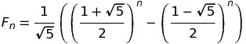
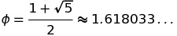

# I C U, You C Me

## Due Date: Tues., Sept. 17, 11:59:59 PM
(Late turn-in deadline (10% off): Thurs., Sept. 19, 11:59:59pm)

## Description
The following problems will give you practice writing basic programs in C, as well as reviewing some fundamental programming concepts like loops and recursion.

This assignment is not supposed to be difficult--it's mainly intended to be practice for using the terminal environment, the compiler, and Mimir. See me quickly if you find yourself struggling with any of these problems.

## Getting Started

Find the Project1 assignment in Mimir.  

You'll follow the same basic procedure you used in our Lab1 exercise:

1. Compile the starter code, submit, make sure you understand the basic procedure. 
2. Read the specifications below and begin developing your solutions in Mimir.  Compile, run, debug as necessary.  
2. Submit your work to Mimir to run against a set of testcases.  
3. You may submit as many times as you wish; I grade the last submission before the deadline.
4. When it's time to grade the projects, I'll look over your code and the testcase results, comment on your work, and return it to you.

## Files and Grading
Write 5 programs named `problem1.c`, `problem2.c`, etc. which meet the specifications described below.  Starter code for all of these has been provided for you.  There is also a `Makefile` provided for you.  You'll have to write your own in the future.  Take a look at it and see how it compiles executables for each problem you submit.  You can just type `make` at the prompt to compile all your files at once.  

When you submit to Mimir, you will need to submit your Makefile and all 5 `.c` files at once.  The easiest way to do this is just to select the directory where your code is when you submit.  In other words, just select your `Project1` directory when Mimir asks you to select files for submission.  As long as your Makefile and 5 `.c` files are in that directory, the testcases will run.

Your grade will be based on the tests you pass. I will also manually examine your files to make sure they have
reasonable style and employ good problem solving strategies (i.e. you can't just print the expected answers). I reserve the right to deduct points for poor programming style (eg. mixing snake_case and camelCase, no comments, etc).

## The Problems

### Problem 1: OHAI DERE
Write a program which prints `Rollins College, CMS230, Fall 2019`.

### Problem 2: Broken Arrow
```
    **
   ****
  ******
 ********
**********
    **
    **
    **
    **
```
Write a function that can produce such an arrow, controled by 2 user inputs.  The height of the arrow head should be controlled by the first input and the height of the shaft should be contolled by the second.  The program prints the arrow.  User inputs of 5 and 4 would produce the above arrow.  

You must use loops to print the correct arrow for any positive value of the height variables -- don't just manually print the answer for 5 and 4!

An input with a value <= 0 is not valid, and the program should only consider valid arguments.  So, for example, the inputs `0, 4` and `3, -1` will still generate either the arrow head or shaft (depending on which argument is valid), but the inputs `-4,0` would not generate any output.

*Hint:* if the height of the arrowhead is *h*, the top level has *h-1* spaces followed by two `*` characters.  The next row has *h-2* spaces followed by four `*` characters, and so forth.  The width of the shaft should always be 2. 

### Problem 3: HeyHowdy
This problem is based on a famous programming interview question described by Imran Gohry. Write a program which takes a single input: the number of integers to print, beginning at 1. Print each number, except

* For numbers divisible by 3 print `Hey`
* For numbers divisible by 5 print `Howdy`
* For numbers divisible by 3 and 5 print `HeyHowdy`

The output for the program with an input of `6` will look like this:
```
1
2
Hey
4
Howdy
Hey
```
If the input is <= 0 the function should not print anything.

### Problem 4: Everyone Needs a Hobby
I am building a triangle of wooden blocks in my back yard.  First I place a row of N blocks on the ground. Then I place N-1 blocks on top of those, then N-2 blocks for my 3rd row and so forth, until I finally place a single block on the top level. A (poorly spaced) example beginning with 3 blocks:

```
    ----
    |   |
  --------
  |   |   |
-------------
|   |   |   |
-------------
```

Write a **recursive** function that calculates and returns the total number of blocks in a triangle given the number of blocks in the bottom row.  You **do not** need to print the triangle.  Just return the number of blocks.  An input of `3` would return 6 (as seen in the diagram above).

*Hint:* The number of blocks in a ten-level wall is the number in a nine-level wall plus 10.  In general,
`
blocks(N) = blocks(N-1) + N
`

### Problem 5: Binet's Formula and Linking with Libraries
Recall the famous Fibonacci sequence, where each term is the sum of the two previous terms:
```
1, 1, 2, 3, 5, 8, 13, 21, 34, ...
```

Binet's Formula (named after the mathematician Jacques Philippe Marie Binet) is an explicit formula for finding terms in the Fibonacci sequence.  The *n*th Fibonacci number, *F<sub>n</sub>*, is given by

<!--
\[
F_n = \frac{1}{\sqrt{5}} \left( \left( \frac{1 + \sqrt{5}}{2} \right)^n - \left( \frac{1 - \sqrt{5}}{2} \right)^n \right)
\]
The special number
\[
\phi = \frac{1 + \sqrt{5}}{2} \approx 1.618033\ldots
\]
is the famous *golden ratio*, the most aesthetically pleasing of all proportions.
-->



The special number



is the famous *golden ratio*, the most aesthetically pleasing of all proportions.

The formula can be derived using **generating functions**, which are awesome but not part of this course.

Write a program that uses Binet's Formula to calculate and print the first N Fibonacci numbers where N is an input from the user. Use `sqrt` and `pow` to perform the calculations; both functions are defined in `math.h`. Look up both commands to see how they're used. 

To use the `pow` function, you'll need to `link` your code with the math library.  **Libraries** are pre-compiled collections of useful routines.  The linking process merges this pre-compiled code into your executable.

Use the `-l` flag to link a library.  The appropriate command is
```
gcc -Wall -Werror -o problem5 problem5.c -lm
```

`gcc` processes the `-l` flag by interpreting the rest of the flag, the letter `m`, as the name of a library. It uses that name to generate a library name in the standard form (`libm.a`), then looks up the library and adds it to your program.

## Submission

Don't forget to complete the README.md file with 2 things:
1. An estimate of the total time you spent on this assignment.
2. Your collaboration statement.  (See the syllabus or ask me if you don't know what this is.)

Make sure your code is clean and commented.  There are some minimal code formatting tests, but these are NOT sufficient.

Make sure your final submission includes your `Makefile`, `problem1.c` - `problem5.c`, and your readme file.
